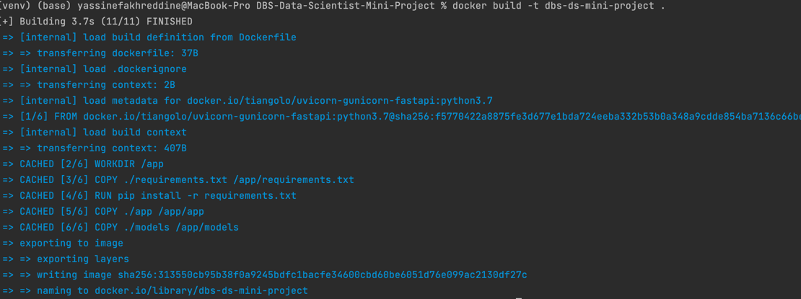

# DBS-Data-Scientist-Mini-Project

# Getting Started 
 

## Folder Structure

 ```
.
├── app                   
│   ├── __init__.py       
│   ├── main.py           # where FastAPI app is configured 
│   ├── router.py         # where script endpoints are defined
│   ├── database.py       # where all the db operation are done 
│   └── predicitions.db   # SQLite DB File          
├── models
│   ├── fasttext.bin      
│   └── fullpipeline.bin  
├── notebooks
│   ├── EDA.ipynb      
│   └── Preprocessing & Modeling.ipynb 
├── results
│   └── predictions.csv  
├── Dockerfile.py         # Configuration file for Docker         
└── README.md 
 ```

## Run API from source code 
```python >= 3.6``` need to be installed
```
# Create virtual environment  
python -m venv ./venv # creates the virtual environment in current directory 
 
# Activate virtual environment 
./venv/Scripts/activate # Windows
source ./venv/bin/activate # Unix & MacOs
 
# Install dependencies
pip install -r requirements.txt 
```
```
# Call main.py to start the API (virtual environment needs to be activated)
python main.py --> It will listen on the port 8000

```
 
## Run API from Docker

```
# Build and tag the image using the Dockerfile in this directory. 
docker build -t dbs-ds-mini-project . 
```
 
```
# Run dbs-ds-mini-project container on the port 8000
docker run -p 8000:8000 dbs-ds-mini-project:new  
``` 

<hr><br>
 
# API Endpoints
The API documentation is accessible at http://localhost:8000/docs
 
### Predict:
POST Method, [/genre/predict](http://localhost:8000/genre/predict) <br>
This Endpoint accepts a list of json objects. For every object all the <b>data points are required</b>. <br>
- If a value is missing it ```null``` value need to be sent. 
- The feature vectors must contain 148 data points. <br>
The API will generate an error is those conditions aren't met   

```json
// The data need to be send via the body as a json
{
  "data": [
    {
      "track_ID": 0,
      "title": "string",
      "tags": "string",
      "loudness": 0,
      "tempo": 0,
      "time_signature": 0,
      "key": 0,
      "mode": true,
      "duration": 0,
      "vectors": [0]
    }
  ]
}
```

### Get Title:
GET Method, [/genre/{genre_name}](http://localhost:8000/genre/pop) <br>
This endpoint return a list of titles belonging to a specific genre , the genre will be giving within thr URL

### Get Genre:
GET Method, [/genre](http://localhost:8000/genre) <br>
This endpoint doesn't have any parameter, it will automatically  return the list of existing genres
<hr><br>
 
